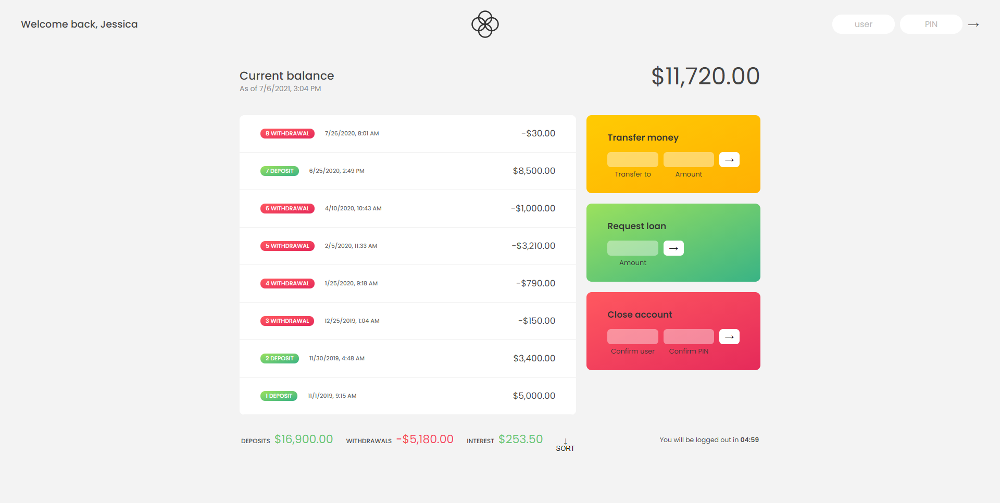

# 💸 Bankist-App


Bankist is a fictitious and minimalistic online banking application that allows the user to:

- Log in with a username and password
- View and sort their monetary movements
- Transfer money to another account
- Request a loan from the bank
- Delete their account

## Built with
<p>
  <a href='https://developer.mozilla.org/en-US/docs/Web/Guide/HTML/HTML5'>
    
  </a>
  &nbsp;
  <a href='https://developer.mozilla.org/en-US/docs/Web/CSS'>
    
  </a>
  &nbsp;
  <a href='https://sass-lang.com/'>
    
  </a>
  &nbsp;
 
  <a href='https://developer.mozilla.org/en-US/docs/Web/JavaScript/Guide'>
    
  </a>
  &nbsp;
  <a href='https://www.typescriptlang.org/'>
    
  </a>
  &nbsp;
  <a href='https://webpack.js.org/'>
    
  </a>
  &nbsp;
  
</p>

## Screenshots




## How to run this project

Clone this repo and install dependencies.

```bash
yarn install
```

## Usage

### Development server

```bash
yarn start
```

You can view the development server at `localhost:8080`.

### Production build

```bash
yarn build
```

### Run Express server

```bash
yarn serve
```

## Acknowledgments

  - The Complete JavaScript Course 2021: From Zero to Expert! by Jonas Schmedtmann


## Author

- [Francis Lagares](https://www.linkedin.com/in/francislagares)

## License

This project is open source and available under the [MIT License](LICENSE).

